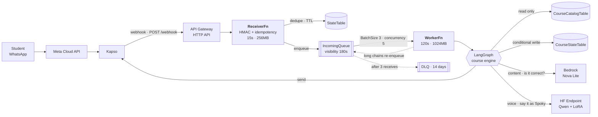
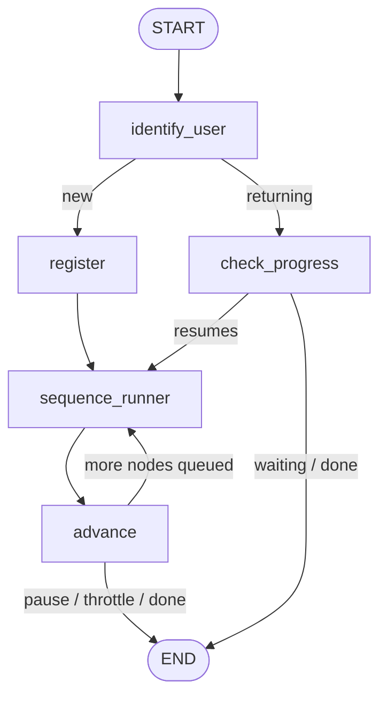

<div align="center">


# Waku Code

**A WhatsApp-native Python tutor for kids who don't have a computer.**

[](https://github.com/GermanParlatto/saturno-v/actions/workflows/ci.yml)
[](https://www.python.org/downloads/)
[](https://aws.amazon.com/serverless/sam/)
[](LICENSE)

</div>

> **Español:** Waku Code es un curso de introducción a Python para niños de 10 a 14 años que
> se imparte entero por WhatsApp. El contenido llega como una historia de ciencia ficción
> narrada por Spoky, un cadete alienígena que se estrelló en la Tierra y necesita un copiloto
> para reparar su nave. No hace falta ordenador, ni instalar nada, ni crear una cuenta.
> El código y los comentarios están en español; este README está en inglés por alcance.
> La documentación de diseño vive en [`docs/`](docs/).

---

## What it is

A 10-to-14-year-old texts a WhatsApp number and starts a course. There is no app to
install, no IDE to configure, no account to create. The syllabus — variables, `print`,
conditionals, loops — arrives as episodes of a story: Spoky's ship, the Waku-Go, crashed
because of one badly written line of code, and it only responds to "the Language of the
Stars," which is Python.

The student answers exercises by typing, or by photographing a notebook page. An LLM
judges whether the answer is right; a second, fine-tuned model delivers the verdict in
Spoky's voice. Getting it wrong is part of the story — Spoky has 847,203 logged failures
and is proud of every one.

## Why WhatsApp

This is the constraint that drove every technical decision in the repo, so it belongs
before the architecture:

| | |
|---|---|
| **~450M** | WhatsApp users in Latin America — 90–99% of everyone with a smartphone |
| **9 in 10** | low-income households connect to the internet *only* by phone |
| **85% vs 17%** | low-income households with a mobile vs. with a PC |

<sub>Sources: GSMA, CEPAL, ENDUTIH/INEGI, INEI Perú, INDEC Argentina (2024–2026).</sub>

A course that requires broadband and an IDE excludes half the continent. Moving from
middle- to low-income households, the phone barely moves; the computer collapses. So the
delivery channel isn't a product choice — it's the requirement, and it cascades:

- **No app, no offline assets.** Everything is a message, and media is served from a
  bucket as an external URL.
- **A 10-second webhook budget** against inference that takes 5–70 seconds. That gap is
  the reason for the whole asynchronous pipeline below.
- **Lessons must survive months of interruption.** State lives outside the Lambda, with
  no TTL on it.

## Architecture



The receiver does nothing but verify, deduplicate, enqueue and return 200 — four steps,
no business logic, because Kapso retries a webhook that answers slowly and a retried
webhook is a duplicate lesson. SQS absorbs the difference between the ack budget and the
inference budget, and gives at-least-once delivery, per-message retries and a dead-letter
queue for free.

The numbers in the diagram are load-bearing: queue visibility (180s) must exceed the
worker timeout (120s) or SQS redelivers a message that is still being processed, and
`BatchSize` is 3 rather than 10 because the worker processes serially and a cold
Hugging Face endpoint costs 30–60s on the first message.

## The course engine

A LangGraph graph, in [`src/course/`](src/course/):



| Node | File | What it does |
|---|---|---|
| `identify_user` | [nodes/identify.py](src/course/nodes/identify.py) | Loads the student from DynamoDB. The only read of the source of truth. |
| `register` | [nodes/register.py](src/course/nodes/register.py) | Creates the row at position 1 with an empty profile. |
| `check_progress` | [nodes/progress.py](src/course/nodes/progress.py) | Evaluates the answer and decides whether the course moves. |
| `sequence_runner` | [nodes/runner.py](src/course/nodes/runner.py) | Sends the current node — media, or LLM-generated text. **Never writes.** |
| `advance` | [nodes/advance.py](src/course/nodes/advance.py) | The single writer. Conditional update on the student's position. |

Routing is [plain Python](src/course/routing.py), no LLM: the path is linear, so the only
decisions are *continue*, *pause* or *stop*.

Four design decisions worth the detour:

- **Send first, persist second.** The runner sends before `advance` records it, because
  the worst case of that order is a duplicated message, and the worst case of the reverse
  is a *skipped lesson*. In a course, duplicating beats omitting.
- **No checkpointer, deliberately.** `CourseStateTable` is already the source of truth for
  position; a LangGraph saver on top would be a second store that can drift from it.
- **Conditional writes, not locks.** At-least-once delivery means two workers can see the
  same position. `advance_position` updates only `if current_order = :expected`; the loser
  gets a `PositionConflict` and stops, instead of advancing the student twice.
- **Self-re-enqueueing continuations.** Between `E1-01` and `E1-08` there are seven
  non-pausing nodes in a row. Rather than burn the 120s timeout, the engine stops after
  `MAX_NODES_PER_INVOCATION`, re-enqueues itself, and resumes from the persisted position.

## Two models, two jobs

| | Model | Responsibility |
|---|---|---|
| **Content** | Bedrock Nova Lite | Is the student's answer correct? ([`course/llm.py`](src/course/llm.py)) |
| **Voice** | Qwen + LoRA on a HF Inference Endpoint | Say it as Spoky ([`shared/voice.py`](src/shared/voice.py)) |

The split exists for a concrete reason: the LoRA is a 2B model fine-tuned to *speak as
the character*, not to judge whether a `print()` is well formed. Asking it to rewrite text
is out-of-distribution for it, and a 2B model can silently alter an identifier or the
indentation of a code sample — which here would be sent to a child as if it were correct.

So the voice layer is built to fail safely:

```
draft (correct) ──▶ Spoky rewrite ──▶ code-integrity check ──▶ send
       │                  │ fails                │ code altered
       └──────────────────┴──────────────────────┴──▶ send the draft
```

`aplicar_voz` never raises. A cold endpoint, a 401, a malformed response, an unexpected
bug — every path returns the draft, and `codigo_preservado()` verifies that *every* code
span in the draft survives the rewrite verbatim before the rewrite is allowed through.
The student always gets a correct answer; they may just get it without the character.
Each degradation emits its own CloudWatch metric (`VozFallback`, `VozCodigoAlterado`).

Spoky's training set was generated by [`tools/script-dataset.py`](tools/script-dataset.py):
documentation (character, lore, syllabus) → synthetic conversation generation via the
Claude API → manual curation, 577 → 500 examples → LoRA fine-tune on Qwen → published on
Hugging Face.

## Engineering highlights

- **No long-lived AWS keys.** Deploys authenticate through GitHub OIDC
  ([`deploy.yml`](.github/workflows/deploy.yml)).
- **CD gated on CI.** `deploy` runs on `workflow_run` after `ci` succeeds, main only, and
  checks out `workflow_run.head_sha` — the exact commit that was tested, not whatever the
  branch points at now.
- **Pre-flight secret checks.** An unset GitHub secret expands to an empty string and
  would deploy green while rejecting every webhook with a 401. The workflow fails first,
  and the template backs it up with `MinLength: 1`.
- **HMAC over the raw body** ([`shared/signature.py`](src/shared/signature.py)) — computed
  on the bytes as received, never on re-serialized JSON, where key order would change the
  signature. Compared with `compare_digest`.
- **Partial batch failures.** The worker returns `batchItemFailures`, so a single failure
  retries one message instead of redelivering the whole batch.
- **Least-privilege IAM.** Explicit action lists per table — the catalog is granted
  read-only, because the worker never writes to it.
- **No NAT gateway, and now no VPC at all.** With the data layer entirely on DynamoDB the
  Lambdas stay out of any VPC. Networking cost: zero.
- **PII discipline.** Student text is never logged: the worker records its length and a
  12-character hash. The Hugging Face token never reaches a log line — there's a test
  asserting it.
- **Lockfile drift is a build error.** `src/requirements.txt` is generated from
  `uv.lock`; CI regenerates and diffs it.

## Quick start

Requires Python 3.12, [uv](https://docs.astral.sh/uv/), the AWS SAM CLI, an AWS account
and a [Kapso](https://kapso.ai) account.

```bash
make install          # uv sync --locked
make test             # 134 tests, no AWS calls
make lint             # ruff check + format --check

make deploy           # sam build && sam deploy
```

The deploy needs five parameters: `KapsoApiKey`, `KapsoWebhookSecret`, `LangsmithApiKey`,
`SpokyEndpointUrl`, `SpokyApiToken`. Register the stack's `WebhookUrl` output in Kapso.

The course catalog is seeded from [`data/`](data/) by
[`tools/seed-course.py`](tools/seed-course.py), which runs automatically after a
successful deploy ([`seed.yml`](.github/workflows/seed.yml)) and is version-gated: it
compares `CATALOG_VERSION` in code against a control item in the table and writes nothing
when they match. `ASSET_BASE_URL` points it at the bucket serving the media.

## Testing

134 tests, ~1.5s, no AWS calls and no network: `respx` intercepts HTTP, boto3 is stubbed.

[`tests/test_voice.py`](tests/test_voice.py) is the one to read first — it pins the
degradation contract described above, including that *any* exception falls back to the
draft rather than only the anticipated ones.

Not covered: the receiver's HMAC/idempotency path and the agent's end-to-end behaviour
have no evaluation suite yet.

## Project layout

```
src/
  receiver/   webhook Lambda: verify, deduplicate, enqueue, 200
  worker/     SQS consumer: drives the course engine
  course/     the LangGraph engine — graph, nodes, catalog, repository, prompts
  shared/     Kapso + Spoky clients, HMAC, voice, WhatsApp formatting
infra/        AWS SAM template
data/         course catalog (nodes + sequence) as CSV
docs/         design docs, in Spanish: character, lore, syllabus, guardrails
tools/        catalog seeder, dataset generator, manual probe
```

## Roadmap & limitations

- Secrets are SAM template parameters, not Secrets Manager.
- One course per stack (`COURSE_ID`).
- The HF endpoint scales to zero, so the first message after an idle period pays a
  30–60s cold start and often lands on the voice fallback.
- No RAG or knowledge base — the stubs for one were removed rather than left dangling.
- Content covers Level 0 only: 70 nodes.
- LangSmith for tracing; Langfuse is on the list to evaluate.

## Credits

Built by **Gustavo Arana Osorio**, **Adolfo Capellades**, **German Parlatto** and
**Fran Rodriguez Cordoba**.

Character art and video generated with Veo 3.1, Eleven Labs and Seedance 3.0, with manual
post-production.

## License

[MIT](LICENSE).
